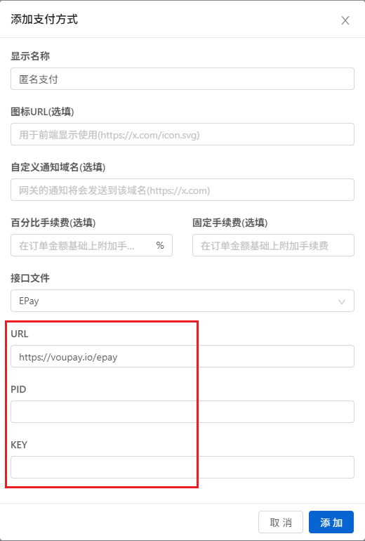

# XBoard 支付设置

`cedar2025/Xboard`（兼容 `v2board/v2board`）接入 VouPay 时，只需要在后台（支付配置）添加一个支付方式，并填写以下内容。

## 必填项

| 配置项 | 填写内容 |
| --- | --- |
| 接口文件 | `EPay` |
| URL | `https://voupay.io/epay` |
| PID | 在 <https://voucash.com/dev/apps> 获取 |
| KEY | 在 <https://voucash.com/dev/apps> 获取 |

注册后可在“我的应用”中查看商户 ID 和密钥。
